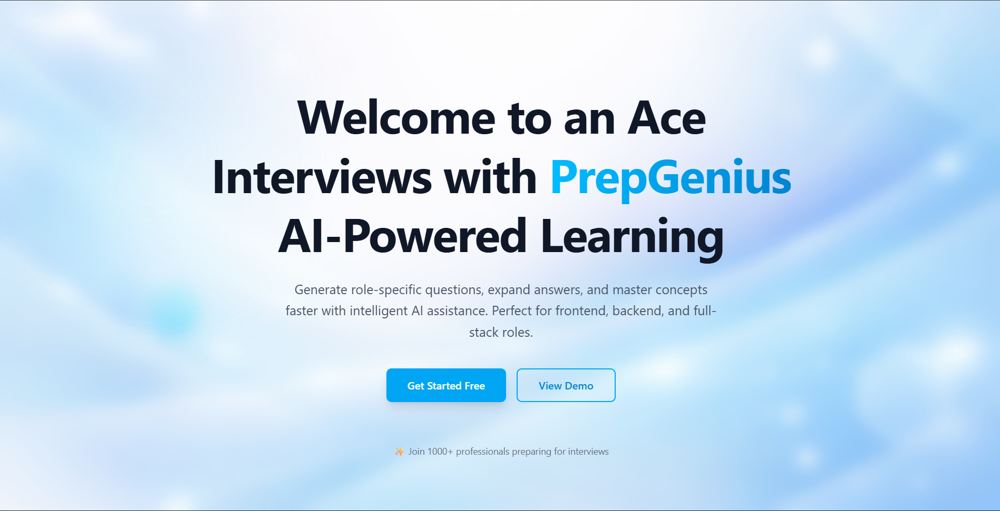
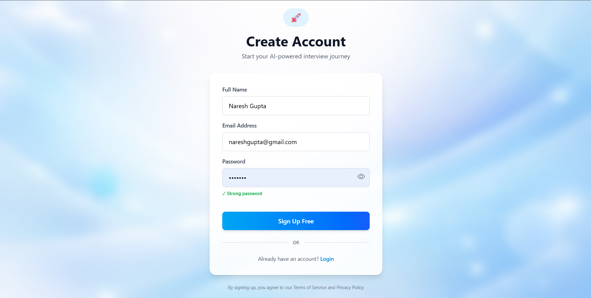
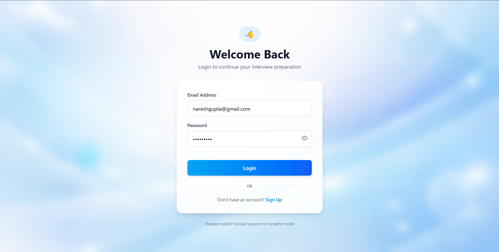
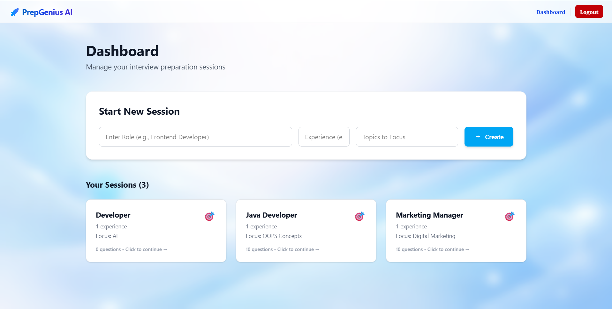
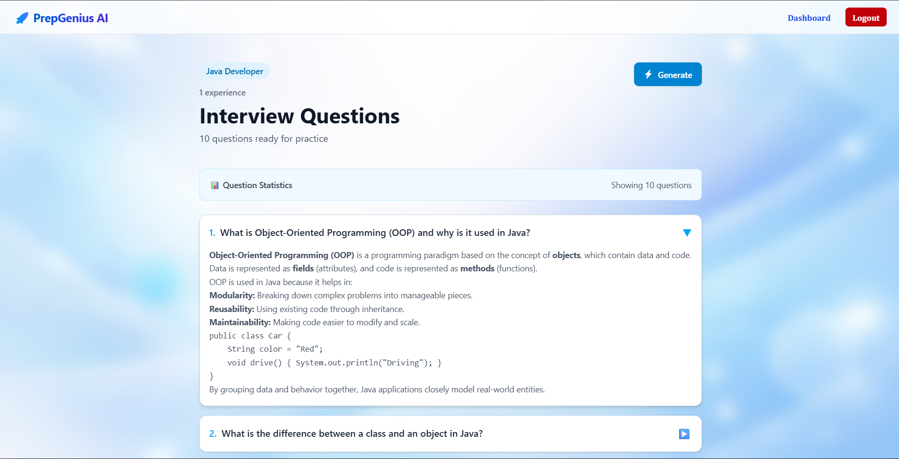

# 🚀 PrepGenius AI

**PrepGenius AI** is an AI-powered interview preparation platform designed to help students and job seekers prepare for technical interviews through personalized practice, AI-generated questions, interview sessions, and performance tracking.

The project uses **React** for the frontend and **Java Spring Boot** for the backend, with **MongoDB** for data storage and **Google Gemini AI** for intelligent question generation.

---

## 🌐 Live Demo

**Frontend:**  
https://prepgeniusai-app.vercel.app

**Backend:**  
https://prepgenius-ai-java.onrender.com

> The frontend is deployed on **Vercel**, while the Spring Boot backend is deployed on **Render**.

---

## ✨ Features

### 🔐 User Authentication

- User registration and login
- JWT-based authentication
- BCrypt password hashing
- Secure API endpoints using Spring Security
- Protected user-specific resources

### 🤖 AI-Powered Interview Questions

- Generate interview questions using Google Gemini AI
- Questions based on selected technologies and topics
- Dynamic AI-generated interview preparation content
- Technical interview preparation

### 📝 Interview Preparation

- Practice technical interview questions
- Create interview preparation sessions
- Track questions and answers
- Prepare for different technical topics

### 📊 Session Management

- Create and manage interview sessions
- Store interview questions and responses
- Track preparation progress
- Retrieve session-specific data

### 👤 User Profile

- Secure user-specific data
- Retrieve authenticated user information
- JWT-based access to protected resources

### 🌐 RESTful API

- Backend APIs built with Spring Boot
- REST-based architecture
- JSON request and response handling
- API testing using Postman

---

## 🛠️ Tech Stack

### Frontend

- React.js
- Vite
- Tailwind CSS
- JavaScript
- HTML5
- CSS3
- Axios
- React Router
- React Hot Toast

### Backend

- Java 25
- Spring Boot 4
- Spring Security
- Spring Data MongoDB
- REST API
- JWT
- BCrypt
- Lombok
- Maven

### Database

- MongoDB Atlas
- MongoDB Compass

### AI

- Google Gemini API

### Development Tools

- Spring Tools Suite (STS)
- VS Code
- Postman
- MongoDB Compass
- MongoDB Atlas
- Git
- GitHub

### Deployment

- Vercel — Frontend
- Render — Backend
- MongoDB Atlas — Database

---

## 🏗️ Project Architecture

```text
                        ┌─────────────────────────┐
                        │        Vercel           │
                        │   React + Vite Frontend │
                        └────────────┬────────────┘
                                     │
                                     │ HTTPS / REST API
                                     ▼
                        ┌─────────────────────────┐
                        │         Render          │
                        │    Spring Boot Backend  │
                        └────────────┬────────────┘
                                     │
                  ┌──────────────────┼──────────────────┐
                  │                  │                  │
                  ▼                  ▼                  ▼
          ┌──────────────┐   ┌──────────────┐   ┌──────────────┐
          │ MongoDB      │   │    JWT /     │   │   Google     │
          │    Atlas     │   │ Spring       │   │   Gemini AI  │
          │              │   │ Security     │   │              │
          └──────────────┘   └──────────────┘   └──────────────┘

---

## Application Flow

User
 │
 ▼
React Frontend
 │
 │ REST API
 ▼
Spring Boot Backend
 │
 ├──────────────► MongoDB Atlas
 │
 ├──────────────► JWT / Spring Security
 │
 └──────────────► Google Gemini API
 
## 📂 Project Structure

### Backend

backend/
├── src/
│   └── main/
│       ├── java/
│       │   └── com/
│       │       └── prepgeniusai/
│       │           ├── config/
│       │           ├── controller/
│       │           ├── dto/
│       │           ├── model/
│       │           ├── repository/
│       │           ├── security/
│       │           ├── service/
│       │           └── BackendApplication.java
│       │
│       └── resources/
│           └── application.properties
│
├── pom.xml
├── Dockerfile
└── README.md

### Frontend

frontend/
├── src/
│   ├── components/
│   ├── pages/
│   ├── services/
│   ├── App.jsx
│   └── main.jsx
│
├── public/
├── package.json
└── README.md

---

## 🔐 Authentication Flow

PrepGenius AI uses JWT-based authentication with Spring Security.

User
 │
 ▼
Register / Login
 │
 ▼
Spring Boot Authentication API
 │
 ▼
Validate Credentials
 │
 ▼
BCrypt Password Verification
 │
 ▼
Generate JWT
 │
 ▼
Frontend Stores Token
 │
 ▼
Token Sent with Protected API Requests
 │
 ▼
JWT Authentication Filter
 │
 ▼
Validate JWT
 │
 ▼
Protected API Access

Passwords are securely hashed using **BCrypt** before being stored in MongoDB.

---

## 🤖 AI Question Generation

The application integrates the Google Gemini API to dynamically generate interview questions.

Example flow:

User selects technologies/topics
          │
          ▼
     React Frontend
          │
          ▼
    Spring Boot API
          │
          ▼
     Google Gemini
          │
          ▼
 Generated Questions
          │
          ▼
      MongoDB
          │
          ▼
     React Frontend

---

## ⚙️ Environment Variables

Sensitive credentials are not stored directly in the source code.

### Backend

The Spring Boot backend uses environment variables for:

```env
MONGODB_URI=your-mongodb-url
JWT_SECRET=your-secret-key
GEMINI_API_KEY=your-gemini-api-key
PORT=your-port
```

Example application.properties configuration:

spring.mongodb.uri=${MONGO_URI}
jwt.secret=${JWT_SECRET}
gemini.api-key=${GEMINI_API_KEY}
server.port=${PORT}

### Frontend

The React/Vite frontend uses:

```env
VITE_API_BASE_URL=https://prepgenius-ai-java.onrender.com
```

---

## 🚀 How to Run the Project

### 1. Clone the Repository

```bash
git clone https://github.com/NARESHGUPTA0912/PrepGenius-AI.git
```

```bash
cd prepgenius-ai
```

---

### 2. Start MongoDB

Make sure MongoDB is running locally or configure MongoDB Atlas.

Example local connection:

```text
mongodb://localhost:27017
```

---

### 3. Run the Backend

Navigate to the backend directory:

```bash
cd backend
```

Run using Maven:

```bash
mvn spring-boot:run
```

The backend will start on:

```text
http://localhost:8082
```

---

### 4. Run the Frontend

Open another terminal:

```bash
cd frontend
```

Install dependencies:

```bash
npm install
```

Start the React development server:

```bash
npm run dev
```

The frontend will be available at the URL displayed by Vite.

---

## 🧪 API Testing

The backend REST APIs can be tested using **Postman**.

### Authentication

```text
POST /api/auth/register
POST /api/auth/login
GET  /api/auth/me
```

### Interview / AI

```text
POST /api/ai/...
POST /api/sessions/...
GET  /api/sessions/...
```

> API endpoints may change as the project continues to evolve.

---

## 🔒 Security

The project implements:

* JWT authentication
* Spring Security
* BCrypt password hashing
* Protected REST endpoints
* User-specific data access
* Environment-based secret configuration
* CORS configuration for the production frontend
* Stateless authentication

---

## ⚙️ CI/CD

This project uses GitHub Actions for continuous integration.

The backend is automatically built using:

- Java 25
- Maven
- Spring Boot

The CI workflow can automatically build the project when changes are pushed to the repository.

---

## 📌 Future Improvements

* 🎤 AI voice-based mock interviews
* 🗣️ Speech-to-text interview interaction
* 📈 Advanced performance analytics
* 🎯 Personalized preparation roadmap
* 📄 Resume-based interview questions
* 💻 Coding interview support
* 🏆 Leaderboards and achievements
* 🌍 Deployment with CI/CD
* 📱 Responsive mobile UI

---

## 📸 Screenshots

```markdown





```

---

## 🎯 Learning Objectives

This project was developed to gain practical experience with:

* Java
* Spring Boot
* Spring Security
* JWT Authentication
* REST API Development
* MongoDB
* React.js
* Vite
* AI API Integration
* Full-Stack Development
* Git & GitHub
* Postman API Testing
* Cloud Deployment
* Environment-Based Configuration
* Frontend–Backend Integration
* CORS Configuration

---

## 👨‍💻 Author

**Naresh Gupta**

MCA | Java Full Stack Developer

### Technologies

```text
Java • Spring Boot • Spring Security • MongoDB
React • JavaScript • REST API • JWT • AI
```

---

## ⭐ Support

If you find this project useful, consider giving it a ⭐ on GitHub.

---

## 📄 License

This project is developed for educational and portfolio purposes.
